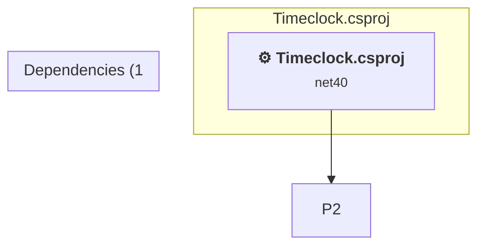

# Projects and dependencies analysis

This document provides a comprehensive overview of the projects and their dependencies in the context of upgrading to .NETCoreApp,Version=v10.0.

## Table of Contents

- [Executive Summary](#executive-Summary)
  - [Highlevel Metrics](#highlevel-metrics)
  - [Projects Compatibility](#projects-compatibility)
  - [Package Compatibility](#package-compatibility)
  - [API Compatibility](#api-compatibility)
  - [Binding Redirect Configuration](#binding-redirect-configuration)
- [Aggregate NuGet packages details](#aggregate-nuget-packages-details)
- [Top API Migration Challenges](#top-api-migration-challenges)
  - [Technologies and Features](#technologies-and-features)
  - [Most Frequent API Issues](#most-frequent-api-issues)
- [Projects Relationship Graph](#projects-relationship-graph)
- [Project Details](#project-details)

  - [%USERPROFILE%\source\repos\TimeClock\TimeclockControls\TimeclockControls.csproj](#%userprofile%sourcerepostimeclocktimeclockcontrolstimeclockcontrolscsproj)
  - [Timeclock.csproj](#timeclockcsproj)

## Executive Summary

### Highlevel Metrics

| Metric | Count | Status |
| :--- | :---: | :--- |
| Total Projects | 3 | All require upgrade |
| Total NuGet Packages | 0 | All compatible |
| Total Code Files | 17 |  |
| Total Code Files with Incidents | 16 |  |
| Total Lines of Code | 3633 |  |
| Total Number of Issues | 1788 |  |
| Estimated LOC to modify | 1782+ | at least 49.1% of codebase |

### Projects Compatibility

| Project | Target Framework | Difficulty | Package Issues | API Issues | Binding Issues | Est. LOC Impact | Description |
| :--- | :---: | :---: | :---: | :---: | :---: | :---: | :--- |
| [%USERPROFILE%\source\repos\TimeClock\TimeclockControls\TimeclockControls.csproj](#%userprofile%sourcerepostimeclocktimeclockcontrolstimeclockcontrolscsproj) | net40 | 🟡 Medium | 0 | 875 | 1 | 875+ | ClassicWinForms, Sdk Style = False |
| [Timeclock.csproj](#timeclockcsproj) | net40 | 🟡 Medium | 0 | 907 | 1 | 907+ | ClassicWinForms, Sdk Style = False |

### Package Compatibility

| Status | Count | Percentage |
| :--- | :---: | :---: |
| ✅ Compatible | 0 | 0.0% |
| ⚠️ Incompatible | 0 | 0.0% |
| 🔄 Upgrade Recommended | 0 | 0.0% |
| ***Total NuGet Packages*** | ***0*** | ***100%*** |

### API Compatibility

| Category | Count | Impact |
| :--- | :---: | :--- |
| 🔴 Binary Incompatible | 1620 | High - Require code changes |
| 🟡 Source Incompatible | 162 | Medium - Needs re-compilation and potential conflicting API error fixing |
| 🔵 Behavioral change | 0 | Low - Behavioral changes that may require testing at runtime |
| ✅ Compatible | 2187 |  |
| ***Total APIs Analyzed*** | ***3969*** |  |

### Binding Redirect Configuration

| Severity | Count | Description |
| :--- | :---: | :--- |
| 🟡Potential | 2 | May cause issues in certain scenarios |
| ***Total Binding Issues*** | ***2*** | ***Across 2 project(s)*** |

## Aggregate NuGet packages details

| Package | Current Version | Suggested Version | Projects | Description |
| :--- | :---: | :---: | :--- | :--- |

## Top API Migration Challenges

### Technologies and Features

| Technology | Issues | Percentage | Migration Path |
| :--- | :---: | :---: | :--- |
| Windows Forms | 1620 | 90.9% | Windows Forms APIs for building Windows desktop applications with traditional Forms-based UI that are available in .NET on Windows. Enable Windows Desktop support: Option 1 (Recommended): Target net9.0-windows; Option 2: Add <UseWindowsDesktop>true</UseWindowsDesktop>; Option 3 (Legacy): Use Microsoft.NET.Sdk.WindowsDesktop SDK. |
| Windows Forms Legacy Controls | 384 | 21.5% | Legacy Windows Forms controls that have been removed from .NET Core/5+ including StatusBar, DataGrid, ContextMenu, MainMenu, MenuItem, and ToolBar. These controls were replaced by more modern alternatives. Use ToolStrip, MenuStrip, ContextMenuStrip, and DataGridView instead. |
| GDI+ / System.Drawing | 147 | 8.2% | System.Drawing APIs for 2D graphics, imaging, and printing that are available via NuGet package System.Drawing.Common. Note: Not recommended for server scenarios due to Windows dependencies; consider cross-platform alternatives like SkiaSharp or ImageSharp for new code. |
| Legacy Configuration System | 13 | 0.7% | Legacy XML-based configuration system (app.config/web.config) that has been replaced by a more flexible configuration model in .NET Core. The old system was rigid and XML-based. Migrate to Microsoft.Extensions.Configuration with JSON/environment variables; use System.Configuration.ConfigurationManager NuGet package as interim bridge if needed. |

### Most Frequent API Issues

| API | Count | Percentage | Category |
| :--- | :---: | :---: | :--- |
| T:System.Windows.Forms.PictureBox | 249 | 14.0% | Binary Incompatible |
| T:System.Windows.Forms.DataGridViewTextBoxColumn | 108 | 6.1% | Binary Incompatible |
| T:System.Windows.Forms.GroupBox | 77 | 4.3% | Binary Incompatible |
| T:System.Drawing.Bitmap | 63 | 3.5% | Source Incompatible |
| T:System.Windows.Forms.DataGridView | 61 | 3.4% | Binary Incompatible |
| T:System.Windows.Forms.Button | 59 | 3.3% | Binary Incompatible |
| T:System.Windows.Forms.ToolStripMenuItem | 57 | 3.2% | Binary Incompatible |
| T:System.Drawing.Image | 51 | 2.9% | Source Incompatible |
| P:System.Windows.Forms.PictureBox.Image | 51 | 2.9% | Binary Incompatible |
| T:System.Windows.Forms.DialogResult | 49 | 2.7% | Binary Incompatible |
| P:System.Windows.Forms.Control.Name | 37 | 2.1% | Binary Incompatible |
| P:System.Windows.Forms.Control.Size | 35 | 2.0% | Binary Incompatible |
| T:System.Windows.Forms.Control.ControlCollection | 30 | 1.7% | Binary Incompatible |
| P:System.Windows.Forms.Control.Controls | 30 | 1.7% | Binary Incompatible |
| M:System.Windows.Forms.Control.ControlCollection.Add(System.Windows.Forms.Control) | 30 | 1.7% | Binary Incompatible |
| P:System.Windows.Forms.Control.Location | 30 | 1.7% | Binary Incompatible |
| T:System.Windows.Forms.BindingSource | 24 | 1.3% | Binary Incompatible |
| T:System.Windows.Forms.SaveFileDialog | 22 | 1.2% | Binary Incompatible |
| T:System.Windows.Forms.ContextMenuStrip | 20 | 1.1% | Binary Incompatible |
| P:System.Windows.Forms.PictureBox.TabStop | 18 | 1.0% | Binary Incompatible |
| P:System.Windows.Forms.PictureBox.TabIndex | 18 | 1.0% | Binary Incompatible |
| M:System.Windows.Forms.PictureBox.#ctor | 18 | 1.0% | Binary Incompatible |
| T:System.Windows.Forms.MessageBoxButtons | 16 | 0.9% | Binary Incompatible |
| T:System.Windows.Forms.OpenFileDialog | 16 | 0.9% | Binary Incompatible |
| P:System.Windows.Forms.ButtonBase.Text | 16 | 0.9% | Binary Incompatible |
| T:System.Windows.Forms.AutoScaleMode | 15 | 0.8% | Binary Incompatible |
| P:System.Windows.Forms.FileDialog.FileName | 14 | 0.8% | Binary Incompatible |
| M:System.Drawing.Bitmap.#ctor(System.IO.Stream) | 14 | 0.8% | Source Incompatible |
| P:System.Windows.Forms.DataGridViewColumn.Name | 13 | 0.7% | Binary Incompatible |
| P:System.Windows.Forms.DataGridViewColumn.HeaderText | 13 | 0.7% | Binary Incompatible |
| P:System.Windows.Forms.DataGridViewColumn.DataPropertyName | 12 | 0.7% | Binary Incompatible |
| P:System.Windows.Forms.Control.TabIndex | 12 | 0.7% | Binary Incompatible |
| M:System.Windows.Forms.DataGridViewTextBoxColumn.#ctor | 12 | 0.7% | Binary Incompatible |
| M:System.Windows.Forms.Control.ResumeLayout(System.Boolean) | 11 | 0.6% | Binary Incompatible |
| P:System.Windows.Forms.DataGridViewColumn.Width | 11 | 0.6% | Binary Incompatible |
| M:System.Windows.Forms.Control.SuspendLayout | 11 | 0.6% | Binary Incompatible |
| T:System.Windows.Forms.DockStyle | 9 | 0.5% | Binary Incompatible |
| T:System.Windows.Forms.AnchorStyles | 9 | 0.5% | Binary Incompatible |
| P:System.Configuration.ApplicationSettingsBase.Item(System.String) | 8 | 0.4% | Source Incompatible |
| T:System.Windows.Forms.Padding | 8 | 0.4% | Binary Incompatible |
| P:System.Windows.Forms.Control.ForeColor | 8 | 0.4% | Binary Incompatible |
| T:System.Windows.Forms.MessageBox | 8 | 0.4% | Binary Incompatible |
| M:System.Windows.Forms.MessageBox.Show(System.String,System.String,System.Windows.Forms.MessageBoxButtons) | 8 | 0.4% | Binary Incompatible |
| P:System.Windows.Forms.ToolStripItem.Size | 8 | 0.4% | Binary Incompatible |
| P:System.Windows.Forms.ToolStripItem.Name | 8 | 0.4% | Binary Incompatible |
| T:System.Windows.Forms.DataGridViewRow | 7 | 0.4% | Binary Incompatible |
| E:System.Windows.Forms.ToolStripItem.Click | 7 | 0.4% | Binary Incompatible |
| P:System.Windows.Forms.ToolStripItem.Text | 7 | 0.4% | Binary Incompatible |
| M:System.Windows.Forms.ToolStripMenuItem.#ctor | 7 | 0.4% | Binary Incompatible |
| P:System.Windows.Forms.DataGridViewColumn.ReadOnly | 6 | 0.3% | Binary Incompatible |

## Projects Relationship Graph

Legend:
📦 SDK-style project
⚙️ Classic project

## Project Details

### Timeclock.csproj

#### Project Info

- **Current Target Framework:** net40
- **Proposed Target Framework:** net10.0-windows
- **SDK-style**: False
- **Project Kind:** ClassicWinForms
- **Dependencies**: 1
- **Dependants**: 0
- **Number of Files**: 14
- **Number of Files with Incidents**: 8
- **Lines of Code**: 2382
- **Estimated LOC to modify**: 907+ (at least 38.1% of the project)

#### Dependency Graph

Legend:
📦 SDK-style project
⚙️ Classic project

### API Compatibility

| Category | Count | Impact |
| :--- | :---: | :--- |
| 🔴 Binary Incompatible | 873 | High - Require code changes |
| 🟡 Source Incompatible | 34 | Medium - Needs re-compilation and potential conflicting API error fixing |
| 🔵 Behavioral change | 0 | Low - Behavioral changes that may require testing at runtime |
| ✅ Compatible | 1255 |  |
| ***Total APIs Analyzed*** | ***2162*** |  |

#### Binding Redirect Configuration

| Rule | Severity | Details | Recommendation |
| :--- | :---: | :--- | :--- |
| AutoGenerateBindingRedirects not set and no manual redirects | 🟡Potential | AutoGenerateBindingRedirects is not set in Timeclock.csproj, no manual redirects found | Explicitly enable <AutoGenerateBindingRedirects>true</AutoGenerateBindingRedirects> or add manual binding redirects. |

#### Project Technologies and Features

| Technology | Issues | Percentage | Migration Path |
| :--- | :---: | :---: | :--- |
| Legacy Configuration System | 13 | 1.4% | Legacy XML-based configuration system (app.config/web.config) that has been replaced by a more flexible configuration model in .NET Core. The old system was rigid and XML-based. Migrate to Microsoft.Extensions.Configuration with JSON/environment variables; use System.Configuration.ConfigurationManager NuGet package as interim bridge if needed. |
| GDI+ / System.Drawing | 19 | 2.1% | System.Drawing APIs for 2D graphics, imaging, and printing that are available via NuGet package System.Drawing.Common. Note: Not recommended for server scenarios due to Windows dependencies; consider cross-platform alternatives like SkiaSharp or ImageSharp for new code. |
| Windows Forms Legacy Controls | 383 | 42.2% | Legacy Windows Forms controls that have been removed from .NET Core/5+ including StatusBar, DataGrid, ContextMenu, MainMenu, MenuItem, and ToolBar. These controls were replaced by more modern alternatives. Use ToolStrip, MenuStrip, ContextMenuStrip, and DataGridView instead. |
| Windows Forms | 873 | 96.3% | Windows Forms APIs for building Windows desktop applications with traditional Forms-based UI that are available in .NET on Windows. Enable Windows Desktop support: Option 1 (Recommended): Target net9.0-windows; Option 2: Add <UseWindowsDesktop>true</UseWindowsDesktop>; Option 3 (Legacy): Use Microsoft.NET.Sdk.WindowsDesktop SDK. |

